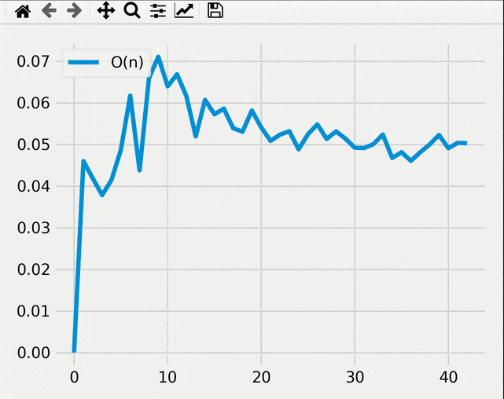

# Welcome

This is just a newbie project about testing an execution time and memory usage of C++, Java, Python, and JavaScript program.

You can add more suggestion for us to make the program better, so we can learn where we can improve it.

This is just an example gif of it

